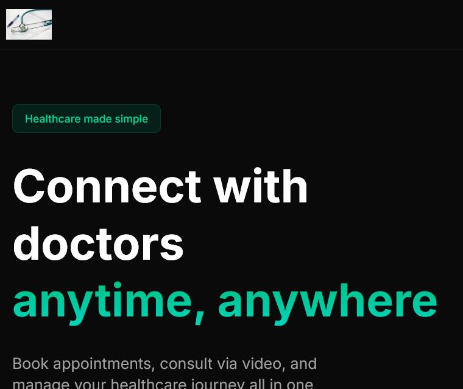

# EasyClinic

<p align="center">
  <strong>A modern telehealth platform for finding doctors, booking appointments, and meeting securely by video.</strong>
</p>

<p align="center">
  Built with Next.js, Clerk, Prisma, PostgreSQL, and Vonage Video.
</p>



## Overview

EasyClinic brings the essential clinic experience into one application. Patients can discover verified doctors, schedule appointments using consultation credits, and join a video consultation. Doctors manage their availability and appointments, while administrators review and verify provider profiles.

## Highlights

- **Role-based journeys** for patients, doctors, and administrators.
- **Doctor discovery** by specialty, with verified-provider workflows.
- **Appointment scheduling** that checks availability and prevents overlapping bookings.
- **Consultation credits** for booking and provider earnings tracking.
- **Secure video consultations** powered by the Vonage Video API.
- **Doctor availability management** and patient appointment history.
- **Responsive dark interface** built with Tailwind CSS and shadcn/ui components.

## Roles and capabilities

| Role | What they can do |
| --- | --- |
| Patient | Complete a profile, find doctors, purchase/use credits, book appointments, and join video calls. |
| Doctor | Complete onboarding, submit credentials, manage availability, review appointments, and join consultations. |
| Administrator | Review pending providers and manage verified doctors. |

## Tech stack

| Area | Technology |
| --- | --- |
| Framework | Next.js 15 (App Router) and React 19 |
| Styling | Tailwind CSS, shadcn/ui, Radix UI, Lucide icons |
| Authentication | Clerk |
| Database | PostgreSQL via Prisma ORM |
| Video | Vonage Video API |
| Validation & forms | Zod, React Hook Form |
| Feedback | Sonner notifications |

## Getting started

### Prerequisites

- Node.js 18.18 or later
- A PostgreSQL database (for example, Neon)
- A Clerk application
- A Vonage Video API application

### 1. Clone and install

```bash
git clone <your-repository-url>
cd EasyClinic
npm install
```

### 2. Configure environment variables

Create a `.env` file in the project root:

```env
DATABASE_URL="postgresql://..."

NEXT_PUBLIC_CLERK_PUBLISHABLE_KEY="pk_..."
CLERK_SECRET_KEY="sk_..."

NEXT_PUBLIC_VONAGE_APPLICATION_ID="..."
VONAGE_PRIVATE_KEY="..."
```

Keep `.env` private. Never commit database URLs, Clerk secrets, or Vonage private keys.

### 3. Prepare the database

```bash
npm run prisma:generate
npx prisma db push
```

### 4. Start the app

```bash
npm run dev
```

Open [http://localhost:3000](http://localhost:3000) in your browser.

## Available scripts

| Command | Description |
| --- | --- |
| `npm run dev` | Generates the Prisma client and starts the development server. |
| `npm run build` | Generates the Prisma client and creates a production build. |
| `npm run start` | Starts the production server after a build. |
| `npm run prisma:generate` | Regenerates Prisma Client from `prisma/schema.prisma`. |
| `npm run lint` | Runs the configured lint command. |

## Project structure

```text
.
├── action/                 # Server actions for appointments, users, credits, and admin data
├── prisma/
│   └── schema.prisma        # Database schema and relations
├── public/
│   └── screenshots/         # README visuals
├── src/
│   ├── app/                 # App Router pages, layouts, and route groups
│   ├── components/          # Reusable interface components
│   └── lib/                 # Prisma client, validation, and application data
└── hooks/                   # Shared React hooks
```

## Core workflow

1. A visitor registers and completes patient or doctor onboarding.
2. A doctor submits credentials and is verified by an administrator.
3. A patient finds a verified doctor, selects an available time, and books with credits.
4. EasyClinic creates a video session and both participants join at the appointment time.

## Data model

The Prisma schema models `User`, `Availability`, `Appointment`, `CreditTransaction`, and `Payout` records. It also defines role, appointment, verification, slot, transaction, and payout states to support the application’s workflows.

## Contributing

Contributions are welcome. Please create a focused branch, keep changes scoped, and verify the affected flow locally before opening a pull request.

## Author

Arvind Rana
